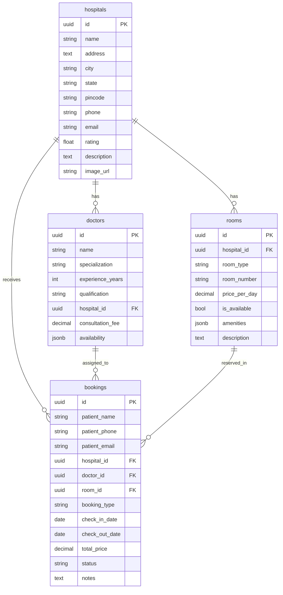
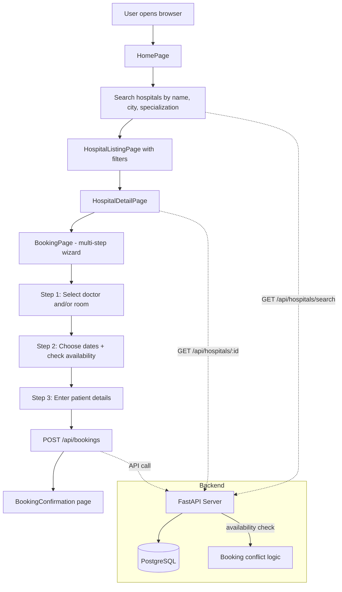

# Hospital Front Desk App — Implementation Plan

**Tech Stack:** React (Vite) · Python FastAPI · PostgreSQL  
**Auth:** None (open access)  

---

## 1. Project Structure

```
c:/sample/
├── backend/
│   ├── app/
│   │   ├── __init__.py
│   │   ├── main.py                 # FastAPI app entry, CORS, router registration
│   │   ├── database.py             # SQLAlchemy engine, session, Base
│   │   ├── models/
│   │   │   ├── __init__.py
│   │   │   ├── hospital.py
│   │   │   ├── doctor.py
│   │   │   ├── room.py
│   │   │   └── booking.py
│   │   ├── schemas/
│   │   │   ├── __init__.py         # Pydantic request/response schemas
│   │   │   ├── hospital.py
│   │   │   ├── doctor.py
│   │   │   ├── room.py
│   │   │   └── booking.py
│   │   ├── routers/
│   │   │   ├── __init__.py
│   │   │   ├── hospitals.py
│   │   │   ├── doctors.py
│   │   │   ├── rooms.py
│   │   │   └── bookings.py
│   │   └── seed.py                 # Seed data script for demo hospitals
│   ├── requirements.txt
│   └── alembic/                    # DB migrations (optional for v1)
│       └── versions/
├── frontend/
│   ├── public/
│   ├── src/
│   │   ├── api/
│   │   │   └── client.js           # Axios instance, base URL config
│   │   ├── components/
│   │   │   ├── layout/
│   │   │   │   ├── Navbar.jsx
│   │   │   │   └── Footer.jsx
│   │   │   ├── hospital/
│   │   │   │   ├── HospitalCard.jsx
│   │   │   │   ├── SearchBar.jsx
│   │   │   │   └── FilterSidebar.jsx
│   │   │   ├── doctor/
│   │   │   │   └── DoctorCard.jsx
│   │   │   ├── room/
│   │   │   │   └── RoomCard.jsx
│   │   │   └── booking/
│   │   │       ├── BookingForm.jsx
│   │   │       └── BookingSummary.jsx
│   │   ├── pages/
│   │   │   ├── HomePage.jsx
│   │   │   ├── HospitalListingPage.jsx
│   │   │   ├── HospitalDetailPage.jsx
│   │   │   └── BookingPage.jsx
│   │   ├── App.jsx
│   │   ├── App.css
│   │   └── main.jsx
│   ├── index.html
│   ├── package.json
│   └── vite.config.js
└── plans/
    └── implementation-plan.md
```

---

## 2. Database Schema (PostgreSQL)

### 2.1 `hospitals`
| Column       | Type         | Notes                        |
|-------------|-------------|------------------------------|
| id          | UUID (PK)   | auto-generated               |
| name        | VARCHAR(200)| NOT NULL                     |
| address     | TEXT        | NOT NULL                     |
| city        | VARCHAR(100)| NOT NULL, indexed            |
| state       | VARCHAR(100)| NOT NULL                     |
| pincode     | VARCHAR(10) |                              |
| phone       | VARCHAR(20) | NOT NULL                     |
| email       | VARCHAR(120)|                              |
| website     | VARCHAR(200)| nullable                     |
| rating      | FLOAT       | default 0, range 0–5         |
| description | TEXT        |                              |
| image_url   | VARCHAR(500)| nullable (placeholder URL)   |
| created_at  | TIMESTAMP   | default now()                |
| updated_at  | TIMESTAMP   | auto-update on modify        |

### 2.2 `doctors`
| Column           | Type         | Notes                         |
|-----------------|-------------|-------------------------------|
| id              | UUID (PK)   | auto-generated                |
| name            | VARCHAR(150)| NOT NULL                      |
| specialization  | VARCHAR(100)| NOT NULL, indexed             |
| experience_years| INTEGER     |                               |
| qualification   | VARCHAR(200)|                               |
| hospital_id     | UUID (FK)   | → hospitals.id, ON DELETE CASCADE |
| consultation_fee| DECIMAL(10,2)| NOT NULL                     |
| availability    | JSONB       | e.g. `{"days":["Mon","Wed"],"slots":["09:00-12:00"]}` |
| created_at      | TIMESTAMP   |                               |
| updated_at      | TIMESTAMP   |                               |

### 2.3 `rooms`
| Column        | Type         | Notes                                          |
|--------------|-------------|------------------------------------------------|
| id           | UUID (PK)   | auto-generated                                 |
| hospital_id  | UUID (FK)   | → hospitals.id, ON DELETE CASCADE              |
| room_type    | VARCHAR(50) | enum-like: General Ward, Semi-Private, Private, ICU, Deluxe |
| room_number  | VARCHAR(20) | NOT NULL                                       |
| price_per_day| DECIMAL(10,2)| NOT NULL                                       |
| is_available | BOOLEAN     | default TRUE                                   |
| amenities    | JSONB       | e.g. `["AC","TV","WiFi","Attached Bathroom"]`  |
| description  | TEXT        |                                                |
| created_at   | TIMESTAMP   |                                                |
| updated_at   | TIMESTAMP   |                                                |

### 2.4 `bookings`
| Column        | Type         | Notes                                              |
|--------------|-------------|----------------------------------------------------|
| id           | UUID (PK)   | auto-generated                                     |
| patient_name | VARCHAR(150)| NOT NULL                                           |
| patient_phone| VARCHAR(20) | NOT NULL                                           |
| patient_email| VARCHAR(120)| nullable                                           |
| hospital_id  | UUID (FK)   | → hospitals.id                                     |
| doctor_id    | UUID (FK)   | → doctors.id, nullable (not all bookings need dr.) |
| room_id      | UUID (FK)   | → rooms.id, nullable                               |
| booking_type | VARCHAR(20) | enum: consultation / admission / both              |
| check_in_date| DATE        | NOT NULL                                           |
| check_out_date| DATE       | nullable (consultation may not need it)            |
| total_price  | DECIMAL(10,2)| calculated before insert                          |
| status       | VARCHAR(20) | enum: pending / confirmed / cancelled / completed  |
| notes        | TEXT        | nullable                                           |
| created_at   | TIMESTAMP   |                                                    |
| updated_at   | TIMESTAMP   |                                                    |

### Entity Relationship Diagram



---

## 3. API Design (FastAPI)

**Base URL:** `http://localhost:8000/api`

### 3.1 Hospitals

| Method | Endpoint                          | Description                        |
|--------|-----------------------------------|------------------------------------|
| GET    | `/hospitals`                      | List all (paginated, 20/page)      |
| GET    | `/hospitals/search?q=&city=&specialization=&min_rating=` | Full-text search + filters |
| GET    | `/hospitals/{id}`                 | Detail (includes doctors & rooms)  |
| GET    | `/hospitals/{id}/availability?date=&room_type=` | Room availability on a date |

**Query params for listing:**
- `page` (int, default 1)
- `page_size` (int, default 20)
- `city` (string, optional)
- `sort_by` (rating / name, default rating)

**Example response (GET /hospitals):**
```json
{
  "total": 45,
  "page": 1,
  "page_size": 20,
  "hospitals": [
    {
      "id": "uuid",
      "name": "City General Hospital",
      "city": "Mumbai",
      "state": "Maharashtra",
      "rating": 4.5,
      "image_url": "...",
      "description": "..."
    }
  ]
}
```

**Detail response includes:**
```json
{
  "hospital": { ...full fields... },
  "doctors": [ { "id", "name", "specialization", "consultation_fee" } ],
  "rooms": [ { "id", "room_type", "room_number", "price_per_day", "is_available", "amenities" } ]
}
```

### 3.2 Doctors

| Method | Endpoint                          | Description                        |
|--------|-----------------------------------|------------------------------------|
| GET    | `/doctors?hospital_id=&specialization=` | List doctors with filters    |
| GET    | `/doctors/{id}`                   | Doctor detail + hospital info      |

### 3.3 Rooms

| Method | Endpoint                          | Description                        |
|--------|-----------------------------------|------------------------------------|
| GET    | `/rooms?hospital_id=&room_type=&is_available=` | List rooms with filters |
| GET    | `/rooms/{id}`                      | Room detail                        |

**Availability check logic:**  
The `/hospitals/{id}/availability` endpoint checks bookings for a given date range and returns only rooms that have no overlapping confirmed bookings.

### 3.4 Bookings

| Method | Endpoint                 | Description                    |
|--------|--------------------------|--------------------------------|
| POST   | `/bookings`              | Create a new booking           |
| GET    | `/bookings/{id}`         | Get booking confirmation       |
| PATCH  | `/bookings/{id}/cancel`  | Cancel a booking               |

**POST /bookings request body:**
```json
{
  "patient_name": "John Doe",
  "patient_phone": "9876543210",
  "patient_email": "john@example.com",
  "hospital_id": "uuid",
  "doctor_id": "uuid|null",
  "room_id": "uuid|null",
  "booking_type": "both",
  "check_in_date": "2026-07-20",
  "check_out_date": "2026-07-22",
  "notes": "Prefer morning slot"
}
```

**Backend calculates `total_price`** based on:
- `consultation`: doctor.consultation_fee
- `admission`: room.price_per_day × number_of_days
- `both`: sum of both

---

## 4. Frontend Pages & Component Tree

### 4.1 Route Map (React Router v6)

| Path                          | Page Component          | Purpose                        |
|-------------------------------|-------------------------|--------------------------------|
| `/`                           | `HomePage`              | Hero search, featured hospitals|
| `/hospitals`                  | `HospitalListingPage`   | Search results + filters       |
| `/hospitals/:id`              | `HospitalDetailPage`    | Hospital info, doctors, rooms  |
| `/book/:hospitalId`           | `BookingPage`           | Multi-step booking flow        |
| `/booking/confirm/:bookingId` | `BookingConfirmation`   | Success page after booking     |

### 4.2 Page Details

#### HomePage (`/`)
- **Hero section** with large search bar (text + city dropdown + specialization filter)
- **Quick stats** (e.g., "200+ Hospitals", "50+ Specializations")
- **Featured hospitals** carousel/grid (top 6 by rating)
- **Footer** with basic links

#### HospitalListingPage (`/hospitals?q=&city=&specialization=`)
- **Left sidebar** with filters:
  - City (dropdown/checkboxes)
  - Specialization (checkboxes from distinct values)
  - Rating (star filter, e.g., 4+)
  - Room type availability
- **Main area:** Grid of [`HospitalCard`](#components) components
- **Pagination** at bottom

#### HospitalDetailPage (`/hospitals/:id`)
- **Header:** Hospital name, rating, address, image
- **Tabs or sections:**
  - **Overview:** Description, contact info
  - **Doctors:** Grid of [`DoctorCard`](#components) with consultation fee + "Book Consultation" button
  - **Rooms:** Grid of [`RoomCard`](#components) with price, amenities + "Book Room" button
- **Sticky CTA:** "Book Now" button that takes to BookingPage

#### BookingPage (`/book/:hospitalId`)
Multi-step form (wizard style, 3 steps):

**Step 1 — Select Services**
- Choose doctor (optional) from dropdown/search
- Choose room type (optional) from cards
- Booking type: Consultation / Admission / Both

**Step 2 — Select Dates**
- Date picker for check-in
- Date picker for check-out (if admission)
- Real-time availability check
- Price summary preview

**Step 3 — Patient Details**
- Name, phone, email
- Notes (optional)
- Final price breakdown
- "Confirm Booking" button → POST /bookings

#### BookingConfirmation (`/booking/confirm/:bookingId`)
- Success message with booking ID
- Summary of booking details
- "Book Another" / "Go Home" buttons

### 4.3 Key Components

| Component          | Props / State                                | Purpose                              |
|-------------------|----------------------------------------------|--------------------------------------|
| `SearchBar`       | onSearch(q, city, spec)                      | Hero + listing search                |
| `HospitalCard`    | { hospital }                                 | Card in listing grid                 |
| `FilterSidebar`   | filters, onFilterChange                      | Sidebar filters for listing          |
| `DoctorCard`      | { doctor, onBook }                           | Doctor display + book button         |
| `RoomCard`        | { room, onBook }                             | Room display + book button           |
| `BookingForm`     | hospitalId, onSubmit                         | Multi-step wizard                    |
| `BookingSummary`  | { booking }                                  | Confirmation display                 |
| `Navbar`          | —                                            | Top nav with logo + links            |
| `Footer`          | —                                            | Bottom footer                        |

### 4.4 State Management
- No Redux — use React's `useState` + `useEffect` per page
- `react-query` (TanStack Query) for server-state caching and refetching

---

## 5. API Client (Frontend → Backend)

File: [`frontend/src/api/client.js`](#)

```javascript
import axios from 'axios';

const api = axios.create({
  baseURL: 'http://localhost:8000/api',
  timeout: 10000,
});

// Endpoints
export const hospitalAPI = {
  list:       (params) => api.get('/hospitals', { params }),
  search:     (params) => api.get('/hospitals/search', { params }),
  detail:     (id)     => api.get(`/hospitals/${id}`),
  availability: (id, params) => api.get(`/hospitals/${id}/availability`, { params }),
};

export const doctorAPI = {
  list:   (params) => api.get('/doctors', { params }),
  detail: (id)     => api.get(`/doctors/${id}`),
};

export const roomAPI = {
  list:   (params) => api.get('/rooms', { params }),
};

export const bookingAPI = {
  create: (data)  => api.post('/bookings', data),
  detail: (id)    => api.get(`/bookings/${id}`),
  cancel: (id)    => api.patch(`/bookings/${id}/cancel`),
};
```

---

## 6. Seed Data

Create [`backend/app/seed.py`](#) with 8–10 demo hospitals across Indian cities:

- **City General Hospital** (Mumbai) — Cardiology, Orthopedics
- **Apollo Health City** (Delhi) — Multi-specialty
- **Fortis Memorial** (Bangalore) — Neurology, Oncology
- **AIIMS Delhi** (Delhi) — Teaching hospital, all specializations
- **Manipal Hospital** (Chennai) — Cardiology, Pediatrics
- **Max Super Specialty** (Mumbai) — Orthopedics, ENT
- **Kokilaben Dhirubhai** (Mumbai) — Multi-specialty
- **Medanta Medicity** (Gurgaon) — Cardiology, Gastroenterology

Each hospital gets:
- 3–5 doctors with different specializations
- 4–6 rooms of various types (General Ward ₹500/day, Private ₹2,500/day, ICU ₹8,000/day, Deluxe ₹5,000/day)

---

## 7. Implementation Order (Execution Steps)

### Phase 1: Backend Foundation
1. Scaffold FastAPI project: [`backend/app/main.py`](#), [`backend/app/database.py`](#), [`backend/requirements.txt`](#)
2. Define all SQLAlchemy models in [`backend/app/models/`](#)
3. Create database tables (auto-create on startup for v1, or Alembic)
4. Write Pydantic schemas in [`backend/app/schemas/`](#)

### Phase 2: Backend APIs
5. Implement [`hospitals` router](#routers/hospitals.py) — list, search, detail, availability
6. Implement [`doctors` router](#routers/doctors.py) — list, detail
7. Implement [`rooms` router](#routers/rooms.py) — list
8. Implement [`bookings` router](#routers/bookings.py) — create, detail, cancel (with price calculation)

### Phase 3: Seed Data
9. Write [`seed.py`](#) and populate the database with demo data

### Phase 4: Frontend Scaffold
10. Create Vite + React project in [`frontend/`](#)
11. Install dependencies (react-router-dom, axios, @tanstack/react-query, tailwindcss or plain CSS)
12. Set up routing in [`App.jsx`](#)
13. Create API client module

### Phase 5: Frontend Pages
14. Build layout components: [`Navbar`](#), [`Footer`](#)
15. Build [`HomePage`](#) with search bar and featured hospitals
16. Build [`HospitalListingPage`](#) with filters and card grid
17. Build [`HospitalDetailPage`](#) with doctor/room tabs
18. Build [`BookingPage`](#) with multi-step wizard
19. Build confirmation page

### Phase 6: Integration & Polish
20. Wire all pages to real API calls
21. Add loading spinners, error states, empty states
22. Responsive CSS adjustments
23. Final end-to-end test with seed data

---

## 8. Key Dependencies

### Backend (`requirements.txt`)
```
fastapi==0.111.0
uvicorn[standard]==0.30.1
sqlalchemy==2.0.30
psycopg2-binary==2.9.9
pydantic==2.7.0
alembic==1.13.1
python-dotenv==1.0.1
```

### Frontend (`package.json` key deps)
```json
{
  "react": "^18.3",
  "react-dom": "^18.3",
  "react-router-dom": "^6.23",
  "axios": "^1.7",
  "@tanstack/react-query": "^5.40"
}
```
- Styling: Plain CSS with CSS modules or Tailwind CSS (your preference)

---

## 9. Mermaid — Full System Flow



---

## 10. CORS Configuration

In [`backend/app/main.py`](#), configure CORS to allow the Vite dev server:

```python
from fastapi.middleware.cors import CORSMiddleware

app.add_middleware(
    CORSMiddleware,
    allow_origins=["http://localhost:5173"],
    allow_credentials=True,
    allow_methods=["*"],
    allow_headers=["*"],
)
```

---

## Summary

| Layer      | Key Decisions                                              |
|-----------|-----------------------------------------------------------|
| Database  | 4 tables — hospitals, doctors, rooms, bookings            |
| Backend   | FastAPI with 4 router modules, price calc on booking      |
| Frontend  | 5 pages, multi-step booking wizard, react-query for caching|
| Search    | Full-text via PostgreSQL ILIKE + city/specialization filters |
| Auth      | None — open access                                        |
| Seeding   | 8–10 hospitals with doctors and rooms for demo            |
